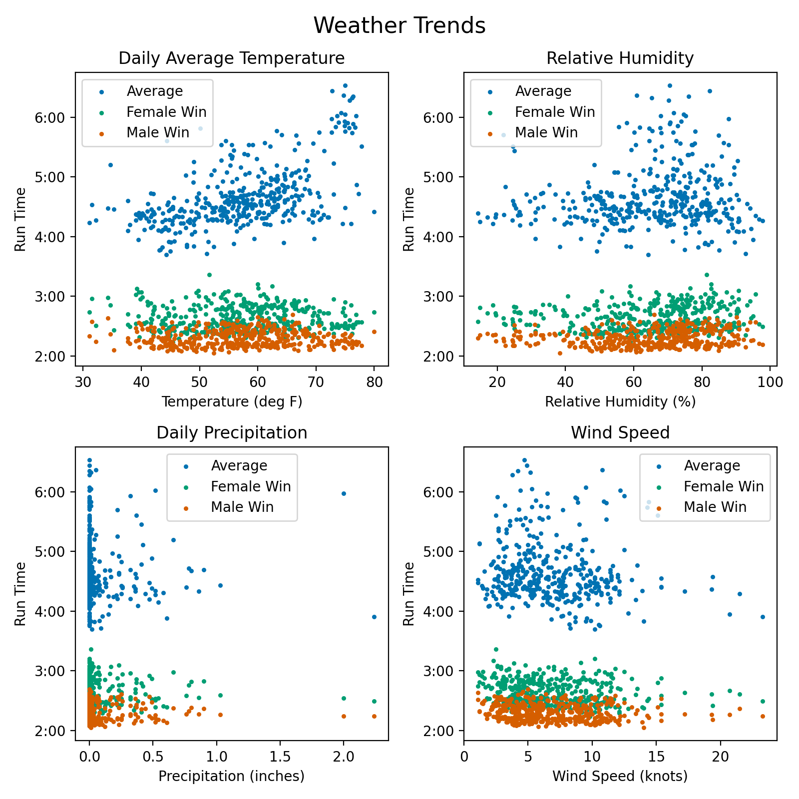

# US Marathon Race Factors and Adjusting Your Pacing Accordingly

### Overview

This is a data science project I created to model marathon times using weather data and elevation data as input features. I scraped data for around 400 marathon instances representing the aggregation of around 20 races from years 2000 to 2022. Regularized linear regression and tree ensemble regression are used to model the average run times, female win times, and male win times. Ridge model coefficients for average run times are extracted to help the typical runner adjust their pacing plan to account for their race day conditions and run a smart race.

If you are interested in my code for __scraping data and compiling__ my original data set, please take a look at the __MarathonDataCollection.ipynb__ jupyter notebook.

The __data visualization and modeling__ is contained in the __MarathonPredictor.ipynb__ jupyter notebook. You will also need my most recent data table csv from the __full_df_csvs__ folder. The units in this data set are listed in the appendix at the bottom of this page.

---

### Introduction

As a runner who has struggled through a few marathons, I am familiar with the added strain that adverse weather and hills can introduce to an already taxing pursuit. A tactical runner would account for these race conditions when formulating their pacing plan before the race even begins, but such calculations require quantifying the likely impact of these factors. So in the interest of fellow marathon runners, I set out to investigate the following questions.

__Objective 1:__ Are variations in average marathon times connected to weather conditions and course elevation changes?

__Objective 2:__ Are marathon win times similarly connected to weather conditions and elevation changes?

__Objective 3:__ How can an average runner adjust their pacing plan to account for race day conditions and run a smart marathon?

I first compiled a data set by scraping marathon race results and course elevation profile metrics from the web and joined corresponding weather data queried from a NOAA database. This involved regex, beautiful soup, selenium, and a lot of data cleaning. (See MarathonDataCollection.ipynb if interested in the details.)

---

### Exploratory Data Analysis

The main notebook MarathonPredictor.ipynb contains the code for modeling, data analysis, and figures. Some selected data visualizations are shown here. Not all input variables are expected to affect individual times, but they are still included to help account for the variances in average times and win times. Violin plots of average marathon time by event show clear trends, which are likely tied to weather/climate and race course elevation profile. Additional violin plots for female win time by event and male win time by event are included in the appendix.

---

### Objective 1: Modeling Average Marathon Times

The average marathon times were modeled with different types of regressors: linear, ridge, lasso, gradient boosting decision tree, and random forest. Model training and testing used a random 75%/25% split of the data set. Since linear models are sensitive to large differences in scale for input variables, a normal scaler transformation based on training split mean and st. dev. was applied to each input variable for linear models. (Tree-based models did not need this type of feature scaling.) Grid searches with 5-fold cross validation were used on the training split to select the best hyperparameters for each model. The modeling performance results are summarized below in Table 1.

#### Table 1: Model Performance

|   Model | Best Params  |   Train R$^2$ |   Test R$^2$ |   CV R$^2$ mean |   CV R$^2$ stdev |   Train RMSE |   Test RMSE |   Train Split stdev |   Test Split stdev |
|----------:|:-----------|:-----------:|:----------:|:--------:|:-----------:|:----------:|:------------:|:-------------:|:------------:|
| Ridge Ave                | [{'alpha': 0.1}]                                              |   0.770101 |  0.760004 |     0.720597 |     0.0383809 |     14.1206  |    16.0569  |            29.4499  |           32.7762  |
| Lasso Ave                | [{'alpha': 1}]                                                |   0.769705 |  0.760624 |     0.723293 |     0.0386154 |     14.1327  |    16.0361  |            29.4499  |           32.7762  |
| Linear Ave               | N/A                                                           |   0.772337 |  0.761092 |     0.696343 |     0.0487966 |     14.0517  |    16.0204  |            29.4499  |           32.7762  |
| Gradient Boosting Ave    | [{'learning_rate': 0.2, 'max_depth': 1, 'n_estimators': 250}] |   0.976153 |  0.93377  |     0.936253 |     0.018465  |      4.54782 |     8.43501 |            29.4499  |           32.7762  |
| Random Forest Ave        | [{'max_features': 0.6, 'max_samples': 1.0}]                   |   0.993026 |  __0.949048__ |     0.941806 |     0.016268  |      2.45943 |     7.3984  |            29.4499  |           32.7762  |
| Ridge Female Win         | [{'alpha': 0.01}]                                             |   0.48608  |  0.545343 |     0.432089 |     0.074542  |      8.77589 |     8.43108 |            12.2417  |           12.5038  |
| Random Forest Female Win | [{'max_features': 0.3, 'max_samples': 1.0}]                   |   0.972522 |  __0.822653__ |     0.795746 |     0.0351898 |      2.02924 |     5.26566 |            12.2417  |           12.5038  |
| Ridge Male Win           | [{'alpha': 0.01}]                                             |   0.508736 |  0.605073 |     0.440895 |     0.0518985 |      5.74884 |     5.20146 |             8.20205 |            8.27689 |
| Random Forest Male Win   | [{'max_features': 0.2, 'max_samples': 1.0}]                   |   0.974109 |  __0.86465__  |     0.790649 |     0.0434219 |      1.31976 |     3.04506 |             8.20205 |            8.27689 |

For average marathon times, the best model tested here was the random forest regressor with an R$^2$ of 0.94 for the test data split, indicating the vast majority of the variation in average marathon run times could be predicted based on the input variables, including weather, elevation, and location. R$^2$ values for 5-fold cross-validation showed a st. dev. <0.02, which suggests this high model performance holds steady on previously unseen data. The gradient boosting tree ensemble showed similarly strong performance, so these fits for these two tree ensembles are plotted below.

#### Tree Ensemble Plots: Ave Times

Linear models (including ridge regression and lasso regression) each had a test split R$^2$ of 0.76, so these methods were less capable of predicting the variation in average run times. Linear models likely show lower performance for this data set because some of the important input variables are not expected to have linear effects on race times. For example, each race location (described by latitude and longitude) tends to attract a different population of marathon runners due to factors like race reputation or proximity to home. Tree-based methods are better able to learn and account for these effects, which are more categorical in nature.

---

### Objective 2: Modeling Marathon Win Times

Female and male win times were modeled with random forests and ridge regressors. Random forests were tested because this model type had the best performance of all regressors tested for average times. Ridge regressor was also included because linear models are easy to interpret based on variable coefficients (we will make use of this for objective 3). Hyperparameters for each model were tuned using grid search with 5-fold cross-validation of the training split, like with the ave time models.

As shown above in Table 1, random forest regressors were the better models for win times, with R$^2$ values of 0.82 for women and 0.86 for men. The random forest models ave times, female wins, and male wins are all plotted together below. (Individual plots for just female win times and just male win times are included in the appendix.) In comparison, the ridge regressors scored 0.54 for women and 0.60 for men. These scores for win time models are lower than the respective R$^2$ values for average times, and this is likely related to differences in observed time variances.

In general, female win times and male win times show less variance than average run times. One likely explanation is that typical marathon runners are strongly affected by adverse weather and hilly courses, creating a large amount of variance in observed average marathon times. In comparison,  elite runners are better able to adapt to conditions and perform consistently, leading to low variance in win times. As such, weather and course conditions were able to predict a smaller proportion of variance for win times than for average run times, as reflected in the R$^2$ scores. In order to explain a larger proportion of win time variance, other variables could be considered, such as scheduling conflicts with competing races (Olympic Games, Olympic Trials, prestigeous marathons) and prize money.

#### Random Forest Plots: Win Times

---

### Objective 3: Quantifying Effects of Race Conditions

Many marathon runners have faced challenging race conditions, including hot temperatures and hilly courses. Pacing goals should be adjusted based on these factors to ensure runner start their races at a sustainable speed and are less likely to resign to walking the last several miles. The modeling of this data set can offer some rough guidance in adjusting pacing plans for an average marathoner.

While linear models did not perform as well as tree-based methods for this data set, they are still able to account for the majority of run time variance and offer interpretable results via the model coefficients. Prior to fitting the linear models, input variables were each normalized using a standard scaler. After fitting, each coefficient was transformed back into original units based on the respective variable's st. dev. Unscaled coefficients for the ridge model are listed below for some variables that runners might want to account for. (A slightly faster than average runner would likely want to make adjustments somewhere between the values for ave times and win times.)

#### Table 2: Highlights on How to Adjust Goal Race Time:
(These are are in relation to what you consider your "normal" training conditions.)

| Variable | Units | Ave Effect | Female Win Effect | Male Win Effect |
|------:|:------:|:------:|:------:|:------:|
| Temperature | sec/deg F | +52 | +26 | +30 |
| Relative Humidity | sec/% | -3 | +17 | +13 |
| Precipitation | sec/inch | +263 | -26 | +78 |
| Wind | sec/mph | -49 | -6 | 0 |
| Elevation | sec/foot | +0.5 | 0.0 | 0.0 |
| Cumulative Elev Loss | sec/foot | -3.6 | -2.4 | -1.9 |
| Cumulative Elev Gain | sec/foot | +3.1 | +2.6 | +1.9 |

These numbers are only to give a rough idea on how to quantify the added difficulty of race conditions while controlling for other variables. Experienced runners know flat courses and easier/faster than hilly courses with zero net elevation change, but the coefficients for the model examined here suggest the hilly course would be about the same. Data from a larger variety of race course elevation profiles would help to improve these coefficient estimates. Likewise, some variables such as precipitation had sparse data with heavily skewed distributions, so coefficient estimates for these variables would improve with additional data. Runners likely will still find these quantified adjustments valuable for pacing if they choose to travel to unfamiliar territory for a marathon with a notably different climate and elevation profile than they are used to.

---

## Appendix

### Dataset Units

__Marathon Data:__
(scraped from http://www.marathonguide.com/index.cfm)
- Date - YYYY-MM-DD
- Finishers - count of total finishers
- Males - count of male finishers
- Females - count of female finishers
- Male Win - time in HH:MM:SS
- Female Win - time in HH:MM:SS
- Average Time - HH:MM:SS
- Time STD - HH:MM:SS
- Percent Female - percent of finishers

__Elevation Data:__
(scraped from https://findmymarathon.com/)
- Elev Gain - cumulative elevation gain in feet
- Elev Loss - cumulative elevation loss in feet
- Max Elev - in feet
- Min Elev - in feet

__Weather Data Types:__
(queried from https://www.ncei.noaa.gov/data/global-summary-of-the-day/doc/readme.txt)
- STATION - Station number (WMO/DATSAV3 possibly combined w/WBAN number) 
- LATITUDE - Given in decimated degrees (Southern Hemisphere values are negative)
- LONGITUDE - Given in decimated degrees (Western Hemisphere values are negative)
- ELEVATION - Given in meters
- TEMP - Mean temperature (Fahrenheit)
- DEWP - Mean dew point (Fahrenheit)
- SLP - Mean sea level pressure (mb)
- STP - Mean station pressure (mb)
- VISIB - Mean visibility (miles)
- WDSP – Mean wind speed (knots)
- MXSPD - Maximum sustained wind speed (knots)
- GUST - Maximum wind gust (knots)
- MAX - Maximum temperature (Fahrenheit)
- MIN - Minimum temperature (Fahrenheit)
- PRCP - Precipitation amount (inches)

All 9's in a field (e.g., 99.99 for PRCP) indicates no report or insufficient data.

### Additional Exploratory Data Analysis

### Win Time Models Plotted Individually

